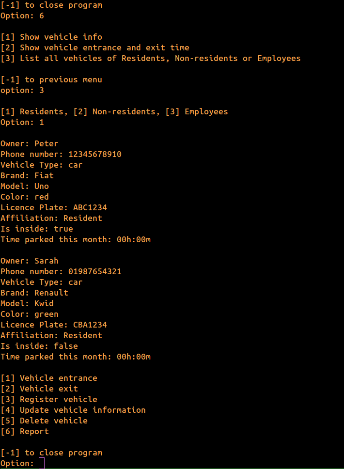

# Parking lot management system

- [Introduction](#introduction)
- [Screenshots](#screenshots)
- [Installation](#installation)
    - [Prerequisites](#prerequisites)
    - [Mandatory settings](#mandatory-settings)
    - [Compilation](#compilation)
- [Run the application](#run-the-application)
## Introduction
command line application for vehicle management in a private parking lot.

The system is capable of:

- Register cars and motorcycles
- Register entrance and exit time
- Differenciate affiliations: employees, residents and non-residents
- Charge a tax based on affiliation type on the first day of month
- List all vehicles of an affiliation type or show specific vehicle if search the license plate
- Update vehicle information
- Delete vehicle
- Check license plate formating(abc1234 or abc1d23) and number(11 digits, ddd 9 and 8 digits) for correct input

## Screenshots




## Installation

### Prerequisites
Postgresql and java 8 or newer.

##### Skip the following instructions if you already is a postgresql user

```sh

sudo apt install postgresql openjdk-17-jdk-headless

```

Download [Postgresql JDBC Driver](https://jdbc.postgresql.org/) for java 8 or newer.

Move postgresql driver to parkinglot folder:
```sh

mv postgresql-42.7.3 path/to//project/parkinglot

```

change user to postgres:
```sh

sudo -i -u postgresql

```

Enter psql tool:
```sh

psql

```

Change "postgres" user password to "password":
```sh

ALTER USER postgres PASSWORD 'password';

```

### Mandatory settings

Create the database:
```sh

CREATE DATABASE parkinglot;

```

Move to inside it:
```sh

\c parkinglot

```

Create the following table:
```sql

CREATE TABLE vehicle (
id SERIAL PRIMARY KEY,
full_name VARCHAR(100),
cellphone VARCHAR(11) UNIQUE,
vehicle_type VARCHAR(10) CHECK (vehicle_type IN ('car', 'motorcycle')),
brand VARCHAR(25),
model VARCHAR(25),
color VARCHAR(20),
license_plate VARCHAR(8) UNIQUE,
affiliation_model VARCHAR(12) CHECK (affiliation_model IN ('Resident', 'Non_resident', 'Employee')),
is_inside BOOLEAN,
entrance TIMESTAMP(0),
exit TIMESTAMP(0),
time_parked integer check(time_parked >= 0)
);

```

Open db.properties and change "user" and "password" for your postgresql username and password in db.username and db.password lines respectively.

if you followed the instructions in prerequisites section, then replace "user" for "postgres" and keep db.password as it already is.

### Compilation
```java

javac -cp .:postgresql-42.7.3.jar *.java
```

## Run the application

```java

java -cp .:postgresql-42.7.3.jar Main

```
